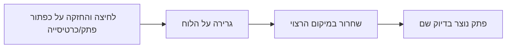

# גרירת פתקים מהכפתורים ללוח

## הגישה החדשה

במקום לחיצה על כפתורים, המשתמש **יגרור** פתק או כרטיסייה מהסרגל אל המיקום הרצוי על הלוח.

## איך זה יעבוד

## חוויית המשתמש

1. **התחלת גרירה** - לוחצים והחזקים על "פתק" או "כרטיסייה"
2. **גרירה** - מזיזים את העכבר למקום הרצוי על הלוח, רואים "צל" של הפתק
3. **שחרור** - משחררים את העכבר, הפתק נוצר בדיוק במיקום הזה

## יתרונות

- שליטה מלאה על מיקום הפתק
- אינטואיטיבי וטבעי
- אין בעיות חישוב מיקום