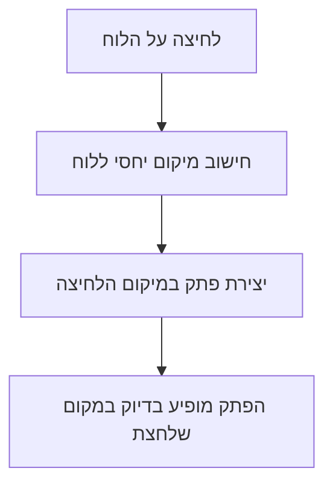

# תיקון מיקום הפתקים בלוח

## הבעיות שזוהו

### בעיה 1: הלחיצה לא מגיעה ל-Canvas
כרגע יש div פנימי שמכסה את כל שטח הלוח (`absolute inset-0`). כשלוחצים על הלוח, הלחיצה נתפסת על ידי ה-div הפנימי הזה ולא על ידי ה-Canvas עצמו.

הקוד בודק: "האם לחצו ישירות עליי?" - והתשובה תמיד "לא" כי הלחיצה נתפסת על ידי הילד.

### בעיה 2: חסר מיקום יחסי
המיכל הראשי חסר הגדרת `position: relative`. בלי זה, האלמנטים הפנימיים לא יודעים ביחס למה להתמקם.

---

## הפתרון

### שינוי 1: העברת הלחיצה ל-div הפנימי
במקום לנסות לתפוס לחיצות על ה-Canvas, נתפוס אותן ישירות על ה-div שמכיל את הפתקים.

### שינוי 2: הוספת position relative
להוסיף `relative` למיכל הראשי כדי שכל המיקומים יהיו נכונים.

### שינוי 3: פישוט המבנה
לפשט את המבנה כך שיהיה ברור איפה הלחיצות נתפסות ואיפה הפתקים ממוקמים.

---

## איך זה יעבוד אחרי התיקון

---

## תוצאה צפויה
- לחיצה על הלוח תיצור פתק **בדיוק** במקום הלחיצה
- הסימן + האדום יישאר במרכז הלוח
- הפתקים יהיו ניתנים לגרירה ועריכה כרגיל