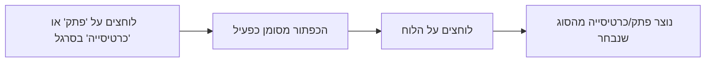

# הוספת בחירת סוג פתק בסרגל הכלים

## איך זה יעבוד

---

## מה ישתנה

### סרגל הכלים
- כפתור **"פתק"** (צהוב) - ליצירת פתקים דביקים
- כפתור **"כרטיסייה"** (כחול) - ליצירת כרטיסיות
- הכפתור הנבחר יהיה מודגש עם מסגרת

### התנהגות
- ברירת מחדל: פתק נבחר
- לחיצה על הלוח תיצור את הסוג שנבחר
- הבחירה נשארת עד שמשנים אותה

---

## תוצאה
- קל לעבור בין יצירת פתקים לכרטיסיות
- ברור תמיד איזה סוג ייווצר בלחיצה הבאה